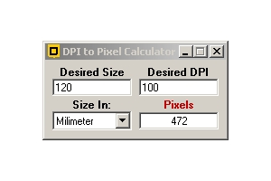



## DPI to Pixel Calculator

### Description

When you resize an image you change the number of pixels. In computer world this is how it is done - there is no inches or centimetres. But when you print out an image the printer uses a resolution that is expressed in DPI (dots per inch). Setting up DPI or the inch size for screen images makes little or no sense. And when an image is printed you can clearly see that the picture has a size in inches.
 
### More Info
 

             |
---                |---
**Submitted On**   |2008-12-11 12:28:50
**By**             |[Fernando Macedo](https://github.com/Planet-Source-Code/PSCIndex/blob/master/ByAuthor/fernando-macedo.md)
**Level**          |Intermediate
**User Rating**    |5.0 (15 globes from 3 users)
**Compatibility**  |VB 6\.0
**Category**       |[Graphics](https://github.com/Planet-Source-Code/PSCIndex/blob/master/ByCategory/graphics__1-46.md)
**World**          |[Visual Basic](https://github.com/Planet-Source-Code/PSCIndex/blob/master/ByWorld/visual-basic.md)
**Archive File**   |[DPI\_to\_Pix21368012112008\.zip](https://github.com/Planet-Source-Code/fernando-macedo-dpi-to-pixel-calculator__1-71513/archive/master.zip)

